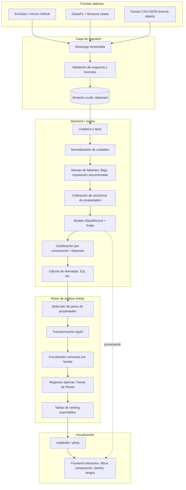

# Arquitectura del prototipo Ashby para vidrios (datos abiertos)

## Objetivo

Sistema extensible para integrar datasets experimentales abiertos (SciGlass vía repositorios públicos, GlassPy, dumps en GitHub), normalizar unidades y metadatos, clasificar familias de vidrio y generar diagramas de Ashby log–log con envolventes y regiones de interés, manteniendo trazabilidad `source_id` → transformaciones → visualización.

## Diagrama de arquitectura (lógica)



## Flujo de datos (extremo a extremo)

1. **Ingestión**: se registra versión del dataset, URL, hash y licencia en `provenance` por lote.
2. **Parsing**: cada fila experimental se mapea a columnas canónicas (nombres de óxidos, propiedades).
3. **Limpieza**: eliminación de duplicados lógicos, detección de outliers con reglas documentadas (no borrar sin flag).
4. **Normalización**: todas las magnitudes físicas a SI (Pa, kg/m³, 1/K, m²/s) con factores explícitos en código (`normalize.py`).
5. **Faltantes**: columnas opcionales; cada gráfico filtra filas válidas para el par (x,y); se puede generar informe de cobertura.
6. **Clasificación**: reglas por composición dominante (SiO₂ / B₂O₃ / P₂O₅) y/o etiquetas de fuente; extensible a ML posterior.
7. **Ashby**: para cada familia, puntos en (ρ, E); envolvente convexa en plano log–log; anotación de mejores por criterio (p. ej. E/ρ).
8. **Salida**: CSV normalizado + PNG/SVG/HTML interactivo; el `source_id` enlaza con el crudo.

## Módulos del repositorio (MVP)

| Módulo | Rol |
|--------|-----|
| `glass_ashby/schema.py` | Contrato de datos `GlassRecord` + trazabilidad. |
| `glass_ashby/normalize.py` | CSV tabular → registros normalizados + export tabla. |
| `glass_ashby/classify.py` | Inferencia de familia desde composición. |
| `glass_ashby/ashby.py` | Filtros por par de propiedades, envolvente en espacio log. |
| `glass_ashby/plot_mvp.py` | Figura E vs ρ (ligereza rígida). |
| `glass_ashby/pipeline.py` | Orquestación reproducible. |
| `scripts/run_mvp.py` | Punto de entrada CLI. |

## Extensiones previstas (mismo patrón)

- **α vs a** (resistencia térmica): reutilizar `ashby.py` con columnas `alpha_1_K`, `a_m2_s`.
- **σ_y vs coste/volumen**: normalizar moneda o índice relativo si no hay coste absoluto.
- **T_g vs m**: diagrama de proceso/nuevos materiales; clustering opcional con scikit-learn sobre vector de composición.

## Fuentes abiertas (integración)

- **SciGlass**: usar solo distribuciones con licencia explícita; colocar archivos en `data/raw/sciglass/` y un manifiesto YAML con versión y URL.
- **GlassPy**: emplear como utilidades de composición/propiedades donde la licencia lo permita, sin mezclar datos no redistribuibles.

## Almacenamiento

- **Fase prototipo**: CSV en `data/raw/` y `data/processed/*_normalized.csv`.
- **Escala**: SQLite o DuckDB con tablas `sources`, `materials`, `measurements`, `lineage`.

## Cómo ejecutar el MVP

```bash
cd d:\Cursor_Proyectos\Glass_Ashby
python -m venv .venv
.\.venv\Scripts\activate
pip install -r requirements.txt
python scripts\run_mvp.py
```

Salida esperada: `data/processed/sample_glasses_normalized.csv` y `data/processed/mvp_stiffness_lightness.png`.
